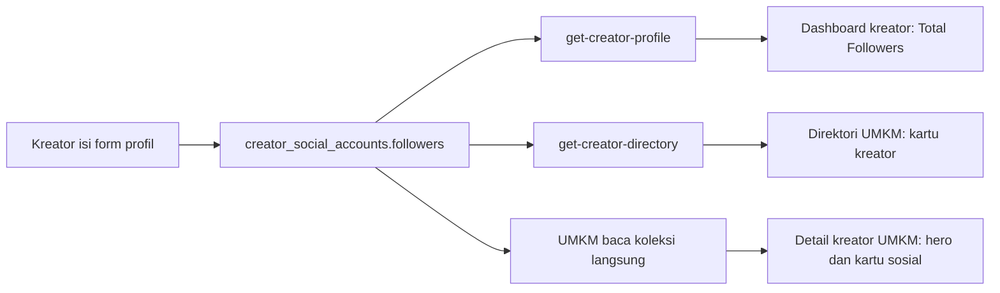

# 🧩 DESIGN: Creator Followers & Directory DTO

> Pendamping `requirements.md`. Fokus: perubahan teknis yang harus dilakukan tim
> backend, daftar artefak yang harus di-redeploy, dan cara verifikasinya.

---

## 1. Alur data follower (setelah perubahan)



Sumber kebenaran tunggal: **`creator_social_accounts.followers`** per akun.
Semua tampilan adalah turunan dari situ.

---

## 2. Perubahan per Function

### 2.1 `get-creator-directory`

Berkas: `00_BACKEND/functions/get-creator-directory/src/main.js`

Saat ini (baris ~79-102) Function sudah membangun dua peta:

- `socialByCreator` — dari `resolvePrimarySocialAccounts()` (satu akun wakil per kreator)
- `startingPriceByCreator` — dari `resolveStartingPrices()`

Tambahkan fungsi ketiga yang sejenis, misal `resolveFollowerTotals()`:

```js
/** Total audiens = jumlah followers SEMUA akun sosial kreator. */
async function resolveFollowerTotals(databases, env, creatorIds) {
  const accounts = await listByIds(
    databases,
    env.databaseId,
    env.creatorSocialAccountsCollectionId,
    "creatorId",
    creatorIds
  );

  const totalByCreator = new Map();
  for (const account of accounts) {
    const creatorId = str(account.creatorId);
    const followers = number(account.followers);
    if (followers <= 0) continue;
    totalByCreator.set(creatorId, (totalByCreator.get(creatorId) ?? 0) + followers);
  }
  return totalByCreator;
}
```

Lalu tambahkan ke `Promise.all` yang sudah ada dan sisipkan ke DTO:

```js
followers: followerTotalsByCreator.get(id) ?? 0,
```

Catatan implementasi:

- `listByIds` sudah menangani chunking 100 ID dan paginasi — pakai helper itu,
  jangan `listDocuments` langsung.
- Jangan mengubah `resolvePrimarySocialAccounts()`: `username` + `engagementRate`
  memang harus dari satu akun yang sama.
- Nilai `0` dikirim apa adanya (frontend yang memutuskan tampilannya).

### 2.2 `get-creator-profile`

Berkas: `00_BACKEND/functions/get-creator-profile/src/main.js`

- Baris ~99: `followers: number(creatorProfile.totalFollowers)` → ganti menjadi
  jumlah `creator_social_accounts.followers` milik kreator tersebut.
- Function ini sudah memuat `socialAccounts` (dipakai untuk `instagramUrl`,
  `tiktokUrl`, dan pemilihan akun primer), jadi tidak ada query tambahan:
  jumlahkan `followers` dari array yang sudah ada.

### 2.3 `create-user-profile`

Tidak perlu diubah. Profil baru tetap dibuat dengan `totalFollowers: 0`; angka
sebenarnya datang dari agregasi akun sosial.

---

## 3. Kontrak DTO (setelah perubahan)

Field baru ditandai **BARU**.

```ts
// get-creator-directory → respons tunggal (body { creatorId })
type CreatorDirectorySingle = {
  id: string;              // userId, bukan $id dokumen profil
  name: string;
  username: string;
  avatarUrl: string;
  bannerUrl: string;
  niche: "kuliner" | "fashion" | "pariwisata" | "edukasi" | "kecantikan" | "lainnya";
  bio: string;
  location: string;
  startingPrice: number;
  rating: number;
  completedJobs: number;
  engagementRate: number;
  followers: number;       // BARU — jumlah semua akun sosial
  isVerified: boolean;
};

// get-creator-directory → respons daftar
type CreatorDirectoryList = {
  items: CreatorDirectorySingle[];
  total: number;
  nextCursor: string | null;
};

// get-creator-profile → dashboard kreator
type CreatorProfileDto = {
  // ...field lama tidak berubah...
  followers: number;       // SUMBER BERUBAH — dulu creator_profiles.totalFollowers
};
```

Frontend sudah punya tipe `CreatorProfile.followers?: number`, jadi penambahan ini
additive dan tidak memecahkan konsumer lama.

---

## 4. Artefak yang harus di-deploy ulang

| Artefak | Path | Alasan |
|---|---|---|
| Function `get-creator-directory` | `00_BACKEND/functions/get-creator-directory/src/main.js` | Menambah field `followers` di DTO |
| Function `get-creator-profile` | `00_BACKEND/functions/get-creator-profile/src/main.js` | Mengganti sumber `followers` ke akun sosial |

Tidak ada yang lain:

- **Skema**: tidak berubah (`creator_social_accounts.followers` sudah ada, integer).
- **Index**: tidak ada index baru yang dibutuhkan (agregasi dilakukan di memori
  setelah `listByIds`, sama seperti `resolveStartingPrices`).
- **Permission**: tidak berubah.
- **Environment variable**: tidak ada tambahan.
- **Collection baru**: tidak ada.

Prosedur deploy mengikuti kebiasaan repo: `appwrite push functions`
(atau push per-Function), lalu pastikan runtime tetap `node-22` sesuai
`appwrite.config.json`.

---

## 5. Verifikasi setelah deploy

1. **Direktori (daftar)**
   - Panggil Function `get-creator-directory` dengan body `{}` sebagai user login.
   - Ekspektasi: setiap item punya `followers` (number). Kreator yang belum
     mengisi apa pun → `0`.
2. **Direktori (tunggal)**
   - Body `{ "creatorId": "<userId kreator yang punya akun sosial>" }`.
   - Ekspektasi: `followers` = jumlah `creator_social_accounts.followers` kreator itu.
3. **Profil kreator**
   - Panggil `get-creator-profile` sebagai kreator yang sudah mengisi followers.
   - Ekspektasi: `followers` = angka yang ia input (dulu selalu 0).
4. **UI UMKM** (tanpa perubahan kode lagi)
   - Buka `/dashboard/umkm/kreator` → kartu kreator menampilkan follower
     (format ringkas, mis. `15,4 rb`), bukan `—`.
   - Buka detail kreator → hero menampilkan angka yang sama.
   - Kreator tanpa data tetap `—`.
5. **Regresi**
   - `engagementRate`, `username`, `startingPrice`, dan paginasi (`total`,
     `nextCursor`) tidak boleh berubah nilainya dibanding sebelum deploy.

---

## 6. Perilaku gagal-tertutup (kontrak UI)

Ini bukan preferensi gaya, tapi kontrak yang sudah diuji di frontend:

| Nilai | Arti | Tampilan |
|---|---|---|
| `followers > 0` | ada data | angka ringkas, mis. `15,4 rb` |
| `followers = 0` atau field tidak ada | belum ada data | `—` |
| request gagal | error | pesan error + tombol "Coba Lagi" (kartu sosial & portofolio) |

Karena itu backend **tidak boleh** mengisi `followers` dengan angka default,
estimasi, atau nilai acak saat data kosong.
