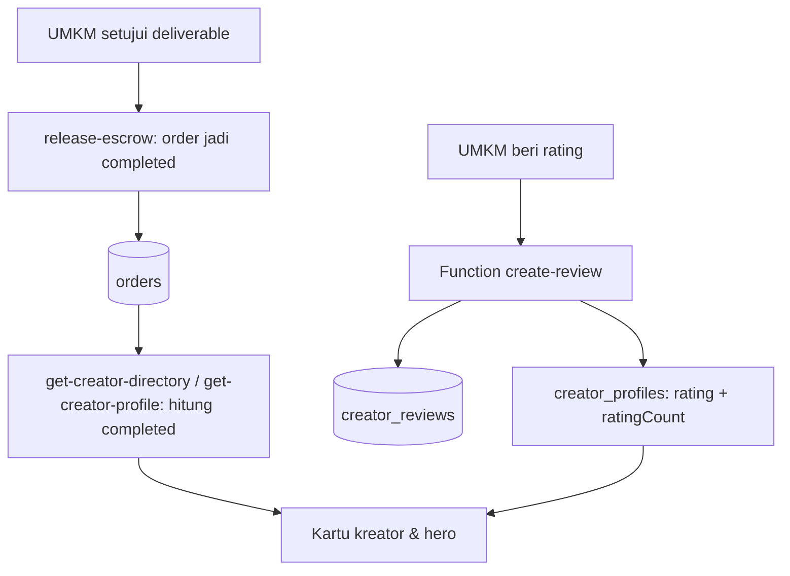

# 🧩 DESIGN: Creator Reviews & Orders Aggregation

> Pendamping `requirements.md`. Fokus: bentuk skema, seam Function, urutan deploy,
> dan invarian yang harus dijaga.

---

## 1. Alur data



Dua sumber berbeda, dua konsumen berbeda:

- **Jumlah order** dihitung dari `orders` saat dibaca (tidak ada kolom cache).
- **Rating** adalah agregat yang ditulis oleh Function ulasan, karena rata-rata
  butuh seluruh riwayat dan tidak layak dihitung di setiap pembacaan direktori.

---

## 2. Skema (perubahan)

### 2.1 Koleksi baru `creator_reviews`

```js
{
  $id: "creator_reviews",
  name: "Creator Reviews",
  $permissions: ['read("any")'],   // tulis hanya lewat Function (server key)
  documentSecurity: true,
  attributes: [
    // orderId unik per ulasan; dipakai juga sebagai kunci idempotensi
    createStringAttr("orderId", true),
    createStringAttr("creatorId", true),
    createStringAttr("umkmId", true),
    createIntAttr("rating", true, 0),      // divalidasi 1..5 di Function
    createStringAttr("comment", false, 1000),
  ],
  indexes: [
    createIndex("idx_orderId", "unique", ["orderId"]),
    createIndex("idx_creatorId", "key", ["creatorId"]),
    createIndex("idx_creatorId_createdAt", "key", ["creatorId", "$createdAt"]),
  ],
}
```

Catatan: index **unique** pada `orderId` adalah pertahanan kedua terhadap ulasan ganda
kalau dua request masuk hampir bersamaan. Function tetap melakukan pengecekan lebih dulu
supaya pesan errornya ramah.

### 2.2 Kolom baru `creator_profiles.ratingCount`

```js
createIntAttr("ratingCount", false, 0),
```

Wajib, karena `rating` rata-rata 0 tidak bisa dibedakan dari "belum ada ulasan".
Kedua kolom ditulis bersama oleh Function ulasan agar tidak pernah tidak sinkron.

### 2.3 Kolom lama yang tetap dipakai

| Kolom | Status |
|---|---|
| `creator_profiles.rating` | Dipakai sebagai **rata-rata** (sumbernya `creator_reviews`) |
| `creator_profiles.totalOrders` | **Tidak lagi menjadi sumber DTO.** Boleh dibiarkan sebagai cache internal atau dihapus kemudian; jangan diisi dua tempat |
| `creator_profiles.totalFollowers` | Sudah deprecated di spec `creator-followers-directory-dto` |

---

## 3. Perubahan Function

### 3.1 `get-creator-directory`

Tambahkan perhitungan jumlah order selesai per kreator, satu batch seperti pola lain
yang sudah ada (`resolvePrimarySocialAccounts`, `resolveStartingPrices`,
`resolveFollowerTotals`):

```js
/**
 * Jumlah order Rate Card berstatus `completed` per kreator.
 * Memakai `total` dari listDocuments (limit 1) — tidak perlu dokumennya.
 * Sumber: `orders` yang ditutup oleh release-escrow.
 */
async function resolveCompletedOrderCounts(databases, env, creatorIds) {
  if (creatorIds.length === 0) return new Map();

  const counts = await Promise.all(
    creatorIds.map(async (creatorId) => {
      const res = await databases.listDocuments(env.databaseId, env.ordersCollectionId, [
        Query.equal("creatorId", creatorId),
        Query.equal("status", "completed"),
        Query.limit(1),
      ]);
      return [creatorId, res.total ?? 0];
    })
  );

  return new Map(counts);
}
```

Lalu di DTO: `completedJobs: completedOrderCounts.get(id) ?? 0` (menggantikan
`number(profile.totalOrders)`).

Catatan implementasi:

- Untuk respons **daftar** dengan 100 kreator ini berarti 100 query. Bila itu dinilai
  terlalu banyak, alternatifnya agregasi ke dalam satu query `orders` dengan
  `Query.equal("creatorId", chunk100)` + `Query.equal("status", "completed")` lalu
  hitung per `creatorId` di memori. Pilih satu dan tulis alasannya di kode.
- Tambahkan `ratingCount` ke DTO: `ratingCount: number(profile.ratingCount)`.

### 3.2 `get-creator-profile`

Sama: `completedJobs` dari hitung `orders` completed milik kreator, plus
`ratingCount: number(creatorProfile.ratingCount)`.

### 3.3 Function baru `create-review`

Berkas: `00_BACKEND/functions/create-review/src/main.js` (pola HTTP Function,
`"type": "module"`, `node-appwrite`).

Alur:

```js
// 1. auth
const callerId = getUserId(req);
if (!callerId) return json(res, { error: "Unauthorized" }, 401);

// 2. validasi input
if (!isValidId(orderId)) return json(res, { error: "Order ID tidak valid." }, 400);
if (!Number.isInteger(rating) || rating < 1 || rating > 5) {
  return json(res, { error: "Rating harus bilangan bulat 1 sampai 5." }, 400);
}

// 3. kepemilikan + status (404 untuk order yang bukan milik pemanggil)
const order = await databases.getDocument(db, ordersCollectionId, orderId)
  .catch(() => null);
if (!order || str(order.umkmId) !== callerId) {
  return json(res, { error: "Order tidak ditemukan." }, 404);
}
if (str(order.status) !== "completed") {
  return json(res, { error: "Order belum selesai." }, 409);
}

// 4. idempotensi
const existing = await databases.listDocuments(db, reviewsCollectionId, [
  Query.equal("orderId", orderId), Query.limit(1),
]);
if (existing.total > 0) {
  return json(res, { ok: true, alreadyReviewed: true, ...(await aggregate(creatorId)) }, 200);
}

// 5. tulis ulasan
await databases.createDocument(db, reviewsCollectionId, ID.unique(), {
  orderId, creatorId: str(order.creatorId), umkmId: callerId,
  rating, comment: str(comment).slice(0, 1000),
}, [
  Permission.read(Role.any()),
  Permission.update(Role.user(callerId)),
  Permission.delete(Role.user(callerId)),
]);

// 6. agregasi + tulis ke creator_profiles
```

Agregasi:

```js
/** Rata-rata dibulatkan 1 desimal; ditulis bersama ratingCount agar tidak drift. */
async function recomputeCreatorRating(databases, env, creatorId) {
  const reviews = await listAll(databases, env.databaseId, env.reviewsCollectionId, [
    Query.equal("creatorId", creatorId),
  ]);
  const count = reviews.length;
  const avg = count === 0
    ? 0
    : Math.round((reviews.reduce((sum, r) => sum + Number(r.rating || 0), 0) / count) * 10) / 10;

  const profiles = await databases.listDocuments(env.databaseId, env.creatorProfilesCollectionId, [
    Query.equal("userId", creatorId),
    Query.limit(1),
  ]);
  const profile = profiles.documents[0];
  if (!profile) return { rating: avg, ratingCount: count };   // tidak ada profil: jangan buat

  await databases.updateDocument(env.databaseId, env.creatorProfilesCollectionId, profile.$id, {
    rating: avg,
    ratingCount: count,
  });
  return { rating: avg, ratingCount: count };
}
```

Invarian yang harus dijaga:

1. `rating` dan `ratingCount` **selalu** ditulis bersama (tidak pernah salah satu).
2. Satu `orderId` maksimal satu ulasan (validasi + unique index).
3. Semua validasi kepemilikan di server; klien tidak boleh menentukan `creatorId`
   maupun `umkmId` (diambil dari order dan sesi).
4. Ulasan hanya untuk order `completed`.
5. Kalau `creator_profiles` tidak ditemukan, Function **tidak** membuat profil baru dan
   tetap mengembalikan agregat supaya UI tidak pecah.

### 3.4 Function ulasan turunan (opsional, hanya kalau Req-5 disetujui boleh ubah)

`update-review` / `delete-review`: memvalidasi pemilik ulasan, lalu memanggil ulang
`recomputeCreatorRating`. Jangan menulis `rating` langsung dari klien.

---

## 4. Kontrak DTO (tambahan pada spec followers)

```ts
// get-creator-directory (tunggal & daftar)
type CreatorDirectoryItem = {
  // ...field sebelumnya, termasuk followers (spec creator-followers-directory-dto)
  completedJobs: number;   // SUMBER BERUBAH: hitung orders completed, bukan totalOrders
  rating: number;          // rata-rata dari creator_reviews
  ratingCount: number;     // BARU: jumlah ulasan
};

// get-creator-profile
type CreatorProfileDto = {
  // ...field sebelumnya
  completedJobs: number;   // SUMBER BERUBAH
  rating: number;
  ratingCount: number;     // BARU
};
```

Frontend perlu satu perubahan kecil mengikuti kontrak ini: `CreatorProfile.ratingCount?:
number` dan hero menampilkan `4.8 (12 Ulasan)` hanya bila `ratingCount > 0`.

---

## 5. Artefak yang harus di-deploy

| Artefak | Jenis | Alasan |
|---|---|---|
| Koleksi `creator_reviews` | Skema (`appwrite push`) | Wadah ulasan |
| Kolom `creator_profiles.ratingCount` | Skema | Pembeda "belum ada ulasan" vs rata-rata 0 |
| Function `get-creator-directory` | Function | `completedJobs` nyata + `ratingCount` |
| Function `get-creator-profile` | Function | `completedJobs` nyata + `ratingCount` |
| Function `create-review` (baru) | Function | Satu pintu tulis ulasan + agregasi |
| Function `update-review` / `delete-review` | Function (opsional) | Hanya bila Req-5 disetujui |

Tidak diperlukan: environment variable baru (semua collection id punya fallback string),
job terjadwal, atau perubahan pada `release-escrow`.

---

## 6. Verifikasi

1. **Order count**
   - Ambil kreator dengan minimal satu order `completed`; panggil
     `get-creator-directory` dengan `{ creatorId }`.
   - Ekspektasi: `completedJobs` sama dengan jumlah order `completed` kreator itu di
     `orders`.
   - Kreator tanpa order completed → `0`.
2. **Ulasan pertama**
   - Sebagai UMKM pemilik order completed, panggil `create-review` rating 5.
   - Ekspektasi: dokumen baru di `creator_reviews`; `creator_profiles.rating = 5` dan
     `ratingCount = 1`.
3. **Idempotensi**
   - Panggil `create-review` lagi dengan `orderId` sama → tidak ada dokumen kedua,
     `ratingCount` tetap 1.
4. **Otorisasi**
   - Sebagai UMKM lain (bukan pemilik order) → 404, tidak ada dokumen dibuat.
   - Tanpa header user → 401.
   - `rating` 0 / 6 / 4.5 → 400, tidak ada dokumen dibuat.
5. **Order belum selesai**
   - Order berstatus `in_progress` → 409.
6. **Agregasi**
   - Ulasan kedua rating 4 dari order lain kreator yang sama →
     `rating = 4.5`, `ratingCount = 2`.
7. **Regresi**
   - `followers`, `username`, `engagementRate`, `startingPrice`, paginasi tidak berubah.
   - `searchCreators` dengan `sortBy: rating_desc` / `orders_desc` sekarang menghasilkan
     urutan yang berbeda dari sebelumnya (bukti kolomnya hidup).

---

## 7. Perilaku gagal-tertutup (kontrak UI, sudah diuji di frontend)

| Nilai | Tampilan |
|---|---|
| `completedJobs > 0` | angka order |
| `completedJobs = 0` | `—` |
| `rating > 0` dan `ratingCount > 0` | bintang + angka + `(N Ulasan)` |
| `rating = 0` atau `ratingCount = 0` | blok bintang disembunyikan total |
| request gagal | pesan error + tombol "Coba Lagi" |

Backend tidak boleh mengisi `rating` dengan angka default, estimasi, atau hasil
pembulatan dari data yang tidak ada.
