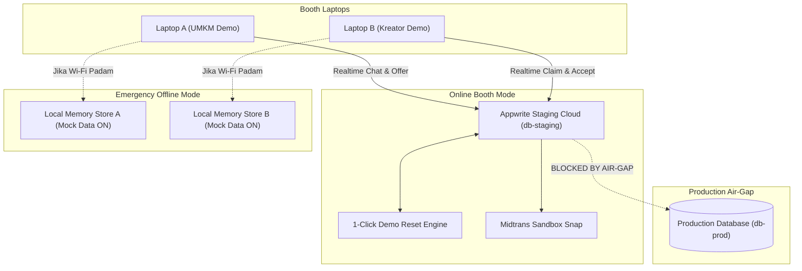

# 🎪 Marketiv Booth Exhibition & Interactive Demo Specification
**Document ID:** `SPEC-BOOTH-DEMO-2026-V1`  
**Target Event:** Pameran & Demo Interaktif Booth (P2MW / Expo Kewirausahaan)  
**Status:** PROPOSED & ACTIONABLE  
**Author:** Antigravity Engineering Team  

---

## 1. Executive Summary & Problem Analysis

Pada saat pameran/expo, booth Marketiv akan dikunjungi oleh ratusan calon pengguna (pelaku UMKM, mahasiswa, mikro-kreator, dewan juri P2MW, dan investor). Mereka akan mencoba langsung fitur-fitur utama platform melalui laptop/tablet yang disediakan di booth.

### Tiga Tantangan Kritis di Lapangan:
1. **Empty State & Visual Disconnection:** Jika database kosong atau berisi data dummy acak (*"test123"*, *"asdf"*, placeholder lorem ipsum), pengunjung tidak akan memahami nilai ekonomi dan estetika Marketiv. Visual dashboard harus tampak hidup, meyakinkan, dan sarat konteks bisnis nyata daerah.
2. **Database Pollution & Production Safety:** Aksi pengunjung (membuat kampanye fiktif, mengirim tawaran sembarangan) tidak boleh mengotori atau merusak Database Production (`db-prod`).
3. **Venue Network Instability (Wi-Fi Pameran Down):** Jaringan internet pameran seringkali lambat (*throttled*), putus-nyambung, atau bahkan padam. Sistem demo tidak boleh *freeze* atau *stuck* di hadapan pengunjung.

---

## 2. Analisis & Evaluasi Opsi Arsitektur

| Parameter Evaluasi | Opsi A: Pure Local Mock (`NEXT_PUBLIC_USE_MOCK_DATA=true`) | Opsi B: Cloud Staging Database (`db-staging`) | Opsi C: Hybrid Fail-Safe Architecture (Rekomendasi) |
| :--- | :--- | :--- | :--- |
| **Ketergantungan Internet** | **Nol (100% Offline)** — Sangat aman dari gangguan Wi-Fi. | **Tinggi** — Memerlukan koneksi stabil ke Appwrite Cloud & Midtrans. | **Adaptif** — Berjalan di Cloud Staging saat online; bisa *fallback* ke Localhost Mock dalam 5 detik jika internet padam. |
| **Keaslian Interaksi Realtime** | Rendah (Data hanya hidup di RAM browser lokal; tidak bisa interaksi multi-device UMKM ↔ Kreator). | **Tinggi (100% Nyata)** — WebSocket Appwrite aktif; Laptop A (UMKM) bisa kirim custom offer ke Laptop B (Kreator) secara *realtime*! | **Tinggi** — Mendukung interaksi multi-device saat online dengan cadangan offline mandiri. |
| **Keamanan Database Prod** | **100% Terisolasi** (Tidak ada koneksi ke DB manapun). | **100% Terisolasi** (Project ID & API Key staging terpisah total dari prod). | **100% Terisolasi** dengan proteksi *Air-Gap Guard* berlapis. |
| **Kemudahan Reset Data** | Sangat Mudah (Cukup refresh browser). | Perlu skrip reset database periodik. | Dilengkapi tombol/skrip **1-Click Reset** (`npm run demo:reset`). |
| **Dukungan Midtrans Snap** | Simulasi lokal (popup preview). | Sandbox Snap asli dengan QRIS & Virtual Account mock. | Sandbox Snap asli di mode staging, simulasi instan di mode mock. |

---

## 3. Solusi Terpilih: Hybrid Fail-Safe Architecture

Pendekatan terbaik adalah **Opsi C (Hybrid Fail-Safe)** yang bertumpu pada 3 pilar:



### Pilar 1: Primary Demo Environment di Appwrite Staging
- Database Staging diisi data pameran (*seed showcase*) yang realistis, menarik, dan berstandar visual tinggi.
- Memungkinkan demonstrasi kolaborasi dua arah:
  - Pengunjung A membuka role **UMKM** di Laptop A.
  - Pengunjung B membuka role **Kreator** di Laptop B.
  - UMKM mengirim penawaran (Custom Offer) &rarr; Seketika muncul di layar Kreator via Realtime Appwrite! Ini memberikan efek *"WOW"* yang sangat kuat kepada pengunjung & juri P2MW.

### Pilar 2: Emergency Localhost Fallback
- Di setiap laptop booth, siapkan clone lokal yang sudah di-*build* (`npm run build && npm run start`) dengan konfigurasi `.env.local`:
  ```bash
  NEXT_PUBLIC_USE_MOCK_DATA=true
  ```
- Jika Wi-Fi venue bermasalah, tim booth cukup membuka tab browser lokal (`http://localhost:3000`) yang 100% mandiri, lancar tanpa delay, dan tidak memerlukan koneksi internet sama sekali.

### Pilar 3: Production Air-Gap Guard
- Skrip seeder memiliki validasi keras (*hard-fail*): jika variabel environment mendeteksi `project-prod` atau URL production, proses langsung berhenti seketika dengan error fatal sebelum melakukan mutasi data apapun.

---

## 4. Desain Konten & Showcase Data (Anti-Slop UI)

Data demo wajib berakar pada realitas UMKM dan kreator lokal Indonesia. Hindari nama fiktif seperti *"John Doe"*, *"Acme Corp"*, atau produk asal-asalan.

### 4.1 Persona & Akun Demo UMKM

| Profil Usaha | Niche / Kategori | Banner & Produk Utama | Saldo Escrow & Campaign Aktif |
| :--- | :--- | :--- | :--- |
| **Sambal Roa Juara Manado** (`umkm.sambal@demo.marketiv.id`) | Kuliner Nusantara | Jar sambal kemasan kaca premium, rempah segar Minahasa. | Saldo: Rp 4.500.000<br>1 Campaign Aktif: *"Review Jujur Sambal Roa Pedas Gurih"* (Budget Rp 1.500.000, Kuota 3 Kreator). |
| **Batik Tulis Sekar Kencana** (`umkm.batik@demo.marketiv.id`) | Fashion Wastra Lokal | Kain sutra batik pewarna alam, kemeja pria modern. | Saldo: Rp 7.200.000<br>1 Negosiasi Berjalan dengan Kreator Fashion. |
| **Kopi Robusta Lereng Ijen** (`umkm.kopi@demo.marketiv.id`) | F&B / Coffee Roastery | Biji kopi sangrai kemasan ziplock matte hitam. | Saldo: Rp 2.800.000<br>Campaign Siap Klaim (Pay-per-view Rp 15/view). |

### 4.2 Persona & Akun Demo Kreator

| Profil Kreator | Niche & Platform | Metrik Performa | Paket Rate Card |
| :--- | :--- | :--- | :--- |
| **Rian Kulineran (Rian Pratama)** (`kreator.rian@demo.marketiv.id`) | Kuliner & Street Food (TikTok & IG Reels) | 48.5K Followers, 8.2% Engagement Rate, Rata-rata 25K views/video. | • Paket 1 Video TikTok Review (Rp 350.000)<br>• Paket Bundling 2 Video + Collab Post (Rp 650.000) |
| **Nadia Style Journal** (`kreator.nadia@demo.marketiv.id`) | Fashion & Lifestyle (Instagram) | 32.1K Followers, Portofolio OOTD Wastra Modern. | • Paket Collab Reel 60s (Rp 500.000)<br>• Paket Story Set 3 Slide (Rp 200.000) |

---

## 5. Alur Pengujian Pengunjung (Interactive Booth Playbook)

Untuk mempermudah pemanduan (*pitching*) di booth, siapkan **Lembar Skenario 2 Menit**:

### Skenario A: "Coba Buat Kampanye Pemasaran (Role UMKM)"
1. **Langkah 1 (Masuk):** Buka browser di Laptop A, klik **Login Cepat UMKM** (akun demo tersimpan).
2. **Langkah 2 (Wizard Buat Campaign):**
   - Klik tombol oranye **"+ Buat Campaign Baru"**.
   - Masukkan Judul: *"Promo Spesial Pameran 2026"*.
   - Pilih Kategori: *Kuliner*.
   - Masukkan Target Views: `10.000 views` &rarr; Sistem otomatis menghitung Budget Escrow: `Rp 150.000`.
   - Unggah/tempel link raw asset video.
3. **Langkah 3 (Simulasi Bayar Escrow):**
   - Klik **"Lanjut ke Pembayaran"** &rarr; Muncul modal konfirmasi rincian biaya (Budget + Platform fee 2%).
   - Klik **"Lanjut ke Pembayaran Midtrans"** &rarr; Popup Midtrans Snap terbuka (QRIS simulator).
   - Klik simulasi bayar sukses &rarr; Status campaign seketika menjadi **Aktif**.

### Skenario B: "Coba Ambil Job & Negosiasi (Role Kreator)"
1. **Langkah 1 (Job Pool):** Di Laptop B, buka halaman **Job Pool**. Kampanye yang baru dibuat di Skenario A langsung muncul di daftar!
2. **Langkah 2 (Klaim Pekerjaan):**
   - Klik kartu kampanye &rarr; Klik tombol **"Klaim Pekerjaan"**.
   - Kuota kampanye terpotong otomatis, pekerjaan masuk ke tab **Pekerjaan Aktif**.
3. **Langkah 3 (Kirim Bukti Tayang):**
   - Masukkan URL postingan TikTok/Instagram: `https://www.tiktok.com/@riankulineran/video/73918291028`.
   - Klik **"Kirim Bukti Tayang"** &rarr; Status berpindah ke *"Menunggu Validasi"*.

### Skenario C: "Coba Negosiasi Custom Offer (Rate Card)"
1. UMKM memilih profil Nadia &rarr; Klik **"Mulai Negosiasi"**.
2. UMKM mengirimkan Custom Offer (Paket Khusus Pameran Rp 450.000).
3. Di layar Kreator, bubble chat Custom Offer muncul secara instan dengan judul snapshot spesifik.
4. Kreator mengklik **"Terima Penawaran"** &rarr; Escrow status berpindah ke *Pending Payment*.

---

## 6. Arsitektur Teknis Seeder & 1-Click Reset

Untuk memastikan database staging bisa dikembalikan ke kondisi awal kapan saja (misal setiap 2 jam atau setelah pengunjung melakukan uji coba ekstrim), dibuat skrip seeder idempotent:

### 6.1 Lokasi File & Perintah Operasional
- **File Skrip:** `00_BACKEND/scripts/seed-demo-booth.ts`
- **NPM Script:** Tambahkan di `package.json`:
  ```json
  "scripts": {
    "demo:seed": "tsx 00_BACKEND/scripts/seed-demo-booth.ts",
    "demo:clean": "tsx 00_BACKEND/scripts/seed-demo-booth.ts --clean-only"
  }
  ```

### 6.2 Mekanisme Pembersihan & Pengisian Data
1. **Air-Gap Verification:**
   ```typescript
   if (process.env.APPWRITE_PROJECT_ID?.includes("prod") || process.env.APPWRITE_ENDPOINT?.includes("api.marketiv.id")) {
     console.error("FATAL: Seeder dilarang keras dijalankan di lingkungan PRODUCTION!");
     process.exit(1);
   }
   ```
2. **Target Collections Cleansed & Seeded:**
   - `users` & `profiles` (Membuat akun demo UMKM & Kreator jika belum ada).
   - `campaigns` (Mengisi 4 campaign dengan status variatif: aktif, kuota terisi, selesai).
   - `rate_cards` (Mengisi rate card terbitan kreator demo).
   - `conversations` & `messages` (Mengisi 2 room chat negosiasi berbobot).
   - `claims` & `submissions` (Mengisi contoh bukti postingan untuk verifikasi admin).
   - `transactions` (Menampilkan riwayat escrow dan deposit agar tab keuangan tampak aktif).

---

## 7. Checklist Kesiapan Operasional Booth (DoD Pameran)

Sebelum pameran dibuka:
- [ ] **Hardware Check:** Minimal 2 laptop (Laptop 1: Layar UMKM, Laptop 2: Layar Kreator) + 1 tablet (Layar Admin / Mobile View).
- [ ] **Koneksi Internet:** Tethering smartphone cadangan 5G/4G dengan kuota melimpah jika Wi-Fi gedung pameran padat.
- [ ] **Staging Verified:** Database staging sudah di-*seed* dengan `npm run demo:seed` dan berhasil login akun demo.
- [ ] **Localhost Standby:** Project di-*build* secara lokal (`npm run build`) dan siap dijalankan dengan `npm run start` (mode `NEXT_PUBLIC_USE_MOCK_DATA=true`) sebagai cadangan darurat.
- [ ] **Browser Kiosk / Bookmarks:** Pasang bookmark langsung ke:
  - `http://localhost:3000/dashboard/umkm`
  - `http://localhost:3000/dashboard/kreator`
  - `http://localhost:3000/dashboard/umkm/campaign/buat`
- [ ] **Password Autofill:** Simpan kredensial akun demo di browser Chrome/Edge agar operator booth tidak perlu mengetik password berulang kali.

---

## 8. Rekomendasi Langkah Selanjutnya

1. **Buat file skrip seeder:** `00_BACKEND/scripts/seed-demo-booth.ts` berisi data showcase terstruktur di atas.
2. **Tambahkan tombol "Quick Switch Demo Account" di halaman login:** (Khusus environment demo/staging) berupa kartu/tombol pintas:
   - *"Masuk sebagai UMKM Demo (Sambal Roa)"*
   - *"Masuk sebagai Kreator Demo (Rian Foodies)"*
   Sehingga saat pergantian pengunjung di booth, operator atau pengunjung cukup 1x klik tanpa perlu mengetik email & password.
